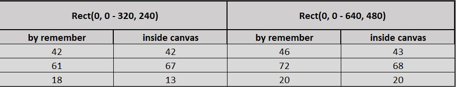

## Face Detection (Compose, CameraX, MlKit)

Sample app to demonstrate [MLKit Face detection](https://developers.google.com/ml-kit/vision/face-detection/android) with CameraX in Compose.

## Benchmark

Of course the face detector is not taking the full size image from the camera, we are cropping it (squashing) to a smaller image to work with.

From the docs: 
>you should use an image with dimensions of at least **480x360** pixels. If you are detecting faces in real time, capturing frames at this minimum resolution can help reduce latency.

My phone didn't support "480x360" dimension, so I have gone a step lower & one higher.

On my test device Samsung M21 (in milliseconds):

<p align="center">
    
</p>

 - First row is average.
 - Second row is slowest. 
 - third row is fastest. 
 
As for the "by rememeber" & "inside canvas", we need to get the canvas size to calculate the boxes (detected faces) position & size.

 - In "by rememeber" I'm getting the size of the canvas from Modifier.onGloballyPositioned and do the math one time thanks to remember.  
 - With "inside canvas" we get the canvas size from DrawScope and do the math everytime detectedFaces change, but as you can see it's sometimes faster than "by rememeber".
 
The calculations are simple but repeating a task that can be avoided don't sound right to me.

## Support me! 

<p align="start">

<a href="https://www.buymeacoffee.com/darkwhiteapps" target="_blank"></a>
</p>

## License

```
MIT License

Copyright (c) 2023 DarkWhite220

Permission is hereby granted, free of charge, to any person obtaining a copy
of this software and associated documentation files (the "Software"), to deal
in the Software without restriction, including without limitation the rights
to use, copy, modify, merge, publish, distribute, sublicense, and/or sell
copies of the Software, and to permit persons to whom the Software is
furnished to do so, subject to the following conditions:

The above copyright notice and this permission notice shall be included in all
copies or substantial portions of the Software.

THE SOFTWARE IS PROVIDED "AS IS", WITHOUT WARRANTY OF ANY KIND, EXPRESS OR
IMPLIED, INCLUDING BUT NOT LIMITED TO THE WARRANTIES OF MERCHANTABILITY,
FITNESS FOR A PARTICULAR PURPOSE AND NONINFRINGEMENT. IN NO EVENT SHALL THE
AUTHORS OR COPYRIGHT HOLDERS BE LIABLE FOR ANY CLAIM, DAMAGES OR OTHER
LIABILITY, WHETHER IN AN ACTION OF CONTRACT, TORT OR OTHERWISE, ARISING FROM,
OUT OF OR IN CONNECTION WITH THE SOFTWARE OR THE USE OR OTHER DEALINGS IN THE
SOFTWARE.
```
